# Cloud Auth

Cloud Auth is a Golang library that can be imported by Cloud API and will feature a collection of authentication middlewares and authorization modules.

Initial implementaion will contain:
  - NGC Authentication Middlewar
  - NGC Role Based Authorization

# Authentication Flow Diagram

```mermaid
flowchart TD
    A[Incoming Request] --> B[Auth Middleware]
    B --> C{Authorization Header Present?}
    
    C -->|No| D[Return 401 Unauthorized]
    C -->|Yes| E[Extract Bearer Token]
    
    E --> F[Parse Unverified Token]
    F --> G{Parse Successful?}
    
    G -->|No| H[Return 401 Unauthorized]
    G -->|Yes| I[Extract Issuer from Claims]
    
    I --> J{Issuer Found?}
    J -->|No| K[Return 401 Unauthorized]
    J -->|Yes| L[Get Processor by Issuer]
    
    L --> M{Processor Found?}
    M -->|No| N[Return 401 Unauthorized]
    M -->|Yes| O[Get JWKS Config by Issuer]
    
    O --> P[ProcessToken]
    
    %% JWT Origin Config Management
    subgraph JWTOriginConfig ["JWT Origin Config Management"]
        Q[configs map: issuer → JwksConfig]
        R[processors map: origin → TokenProcessor]
        S[TokenOriginKas]
        T[TokenOriginSsa] 
        U[TokenOriginKeycloak]
        V[TokenOriginCustom]
        
        Q --> S
        Q --> T
        Q --> U
        Q --> V
        
        R --> S
        R --> T
        R --> U
        R --> V
    end
    
    %% JWKS Fetching and Management
    subgraph JWKSManagement ["JWKS Management & Concurrency Control"]
        %% Lock Management
        subgraph LockManagement ["Read/Write Lock Usage"]
            L1[JWTOriginConfig: sync.RWMutex]
            L2[JwksConfig: sync.RWMutex]
            L3[RLock: Read Operations]
            L4[Lock: Write Operations]
            L5["Multiple RLock Concurrent Reads OK"]
            L6["Lock Blocks All Other Access"]
            
            L1 --> L3
            L1 --> L4
            L2 --> L3
            L2 --> L4
            L3 --> L5
            L4 --> L6
        end
        
        %% JWKS Update Flow
        subgraph UpdateFlow ["JWKS Update Process"]
            W[JWKS Config per Issuer]
            X["RLock: shouldAllowJWKSUpdate()"]
            Y{LastUpdate + 10s < Now?}
            Z["Atomic CAS IsUpdating (0→1)"]
            AA{CAS Success?}
            AB["RLock: Copy URL"]
            AC[Fetch JWKS from URL]
            AD{Valid Keys Found?}
            AE["Lock: Update JWKS & LastUpdate"]
            AF["Atomic Store IsUpdating = 0"]
            AG[Return Error]
            AH[Return ErrJWKSUpdateInProgress]
            
            W --> X
            X --> Y
            Y -->|No| AG
            Y -->|Yes| Z
            Z --> AA
            AA -->|No| AH
            AA -->|Yes| AB
            AB --> AC
            AC --> AD
            AD -->|Yes| AE
            AE --> AF
            AD -->|No| AG
        end
        
        %% Concurrent Thread Management
        subgraph ConcurrencyControl ["Multi-Thread Coordination"]
            C1[Thread 1: Attempts Update]
            C2[Thread 2: Attempts Update]
            C3[Thread 3: Attempts Update]
            C4[Atomic IsUpdating Flag]
            C5[Only ONE Thread Updates]
            C6[Other Threads Get ErrJWKSUpdateInProgress]
            C7[Retry Logic with Delays]
            C8[Check if JWKS Available After Wait]
            C9[Max 5 Retries with 1s Delays]
            C10[All Threads Eventually Converge]
            
            C1 --> C4
            C2 --> C4
            C3 --> C4
            C4 --> C5
            C4 --> C6
            C6 --> C7
            C7 --> C8
            C8 --> C9
            C9 --> C10
            C5 --> C10
        end
        
        %% Read Path Optimizations
        subgraph ReadPaths ["Read-Heavy Optimizations"]
            R1["RLock: GetKeyByID"]
            R3["RLock: Algorithms()"]
            R4["RLock: KeyCount()"]
            R5["RLock: MatchesIssuer()"]
            R6[Multiple Readers Concurrent]
            R7[No Blocking Between Reads]
            
            R1 --> R6
            R3 --> R6
            R4 --> R6
            R5 --> R6
            R6 --> R7
        end
        
        LockManagement --> UpdateFlow
        UpdateFlow --> ConcurrencyControl
        LockManagement --> ReadPaths
    end
    
    %% Token Validation Process
    subgraph TokenValidation ["Token Validation Process"]
        AH[ValidateToken Called]
        AI[Get Supported Algorithms]
        AJ[Create JWT Parser]
        AK[Parse Token with getPublicKey]
        AL{kid in Token Header?}
        
        %% Key Selection Branch 1: With KID
        AM[Get Key by ID]
        AN{Key Found?}
        AO[Try JWKS Update]
        AP[Retry Get Key by ID]
        AQ{Retry Success?}
        AR[Return Key]
        
        %% Key Selection Branch 2: Without KID
        AS[Get All Candidate Keys by Algorithm]
        AT{Candidates Found?}
        AU[Try Each Candidate Key]
        AV{Any Key Works?}
        AW[Return Working Key]
        
        %% Failure Recovery
        AX[All Keys Failed]
        AY[Try JWKS Update with Retry]
        AZ{Update Success?}
        BA[Get Fresh Candidate Keys]
        BB[Try Fresh Keys]
        BC{Fresh Keys Work?}
        BD[Return Fresh Key]
        BE[Return Error]
        
        AH --> AI
        AI --> AJ
        AJ --> AK
        AK --> AL
        
        AL -->|Yes| AM
        AM --> AN
        AN -->|No| AO
        AO --> AP
        AP --> AQ
        AQ -->|Yes| AR
        AQ -->|No| BE
        AN -->|Yes| AR
        
        AL -->|No| AS
        AS --> AT
        AT -->|No| AO
        AT -->|Yes| AU
        AU --> AV
        AV -->|Yes| AW
        AV -->|No| AX
        
        AX --> AY
        AY --> AZ
        AZ -->|Yes| BA
        BA --> BB
        BB --> BC
        BC -->|Yes| BD
        BC -->|No| BE
        AZ -->|No| BE
    end
    
    %% Token Processing by Origin
    subgraph TokenProcessing ["Token Processing by Origin Type"]
        BF[TokenProcessor Interface]
        
        %% KAS Processing
        subgraph KASFlow ["KAS Token Processing"]
            BG[KAS Processor]
            BG1[Parse NgcKasClaims]
            BG2[Extract Subject auxID]
            BG3[DB: UserDAO.GetAll by AuxiliaryID]
            BG4{User Exists & Fresh?}
            BG5[Execute NGC Workflow to Update User]
            BG6[DB: UserDAO.GetOrCreate]
            BG7[Set User in Context]
            
            BG --> BG1
            BG1 --> BG2
            BG2 --> BG3
            BG3 --> BG4
            BG4 -->|No/Stale| BG5
            BG5 --> BG6
            BG4 -->|Yes| BG7
            BG6 --> BG7
        end
        
        %% SSA Processing
        subgraph SSAFlow ["SSA Token Processing"]
            BH[SSA Processor]
            BH1[Check Starfleet ID Headers]
            BH2[Parse SsaClaims]
            BH3[Validate 'kas' Scope]
            BH4[DB: UserDAO.GetOrCreate by StarfleetID]
            BH5[Update User from Headers]
            BH6[DB: UserDAO.Update if needed]
            BH7[Set User in Context]
            
            BH --> BH1
            BH1 --> BH2
            BH2 --> BH3
            BH3 --> BH4
            BH4 --> BH5
            BH5 --> BH6
            BH6 --> BH7
        end
        
        %% Keycloak Processing
        subgraph KeycloakFlow ["Keycloak Token Processing"]
            BI[Keycloak Processor]
            BI1[Parse KeycloakClaims]
            BI2{Service Account?}
            BI3[Check ServiceAccount Mode]
            BI4[Use ClientId as FirstName, Sub as AuxId]
            BI5[Use oidc_id as AuxId]
            BI6[Extract OrgData from Roles]
            BI7[DB: UserDAO.GetOrCreate]
            BI8[DB: UserDAO.Update if OrgData changed]
            BI9[Set User in Context]
            
            BI --> BI1
            BI1 --> BI2
            BI2 -->|Yes| BI3
            BI3 --> BI4
            BI4 --> BI6
            BI2 -->|No| BI5
            BI5 --> BI6
            BI6 --> BI7
            BI7 --> BI8
            BI8 --> BI9
        end
        
        %% Custom Processing
        subgraph CustomFlow ["Custom Token Processing"]
            BJ[Custom Processor]
            BJ1[Parse RegisteredClaims]
            BJ2[Check ServiceAccount Mode Required]
            BJ3[Use Sub as AuxId, Issuer as FirstName]
            BJ4[Create Default Admin Roles: PROVIDER_ADMIN, TEAM_ADMIN]
            BJ5[DB: UserDAO.GetOrCreate]
            BJ6[Set User in Context]
            
            BJ --> BJ1
            BJ1 --> BJ2
            BJ2 --> BJ3
            BJ3 --> BJ4
            BJ4 --> BJ5
            BJ5 --> BJ6
        end
        
        BF --> KASFlow
        BF --> SSAFlow  
        BF --> KeycloakFlow
        BF --> CustomFlow
    end
    
    %% ServiceAccount Mode
    subgraph ServiceAccountMode ["ServiceAccount Mode"]
        SA1[ServiceAccount Flag in JWKS Config]
        SA2{ServiceAccount Enabled?}
        SA3[Allow Service Account Tokens]
        SA4[Reject Service Account Tokens]
        SA5[Keycloak: ClientId-based Authentication]
        SA6[Custom: Default Admin Roles]
        SA7[Regular User Authentication]
        
        SA1 --> SA2
        SA2 -->|Yes| SA3
        SA2 -->|No| SA4
        SA3 --> SA5
        SA3 --> SA6
        SA2 -->|N/A| SA7
    end
    
    %% Main Flow Connections
    L --> JWTOriginConfig
    O --> JWKSManagement
    P --> TokenValidation
    P --> TokenProcessing
    TokenProcessing --> ServiceAccountMode
    
    %% Final Results
    BG7 --> BP{Processing Success?}
    BH7 --> BP
    BI9 --> BP
    BJ6 --> BP
    BP -->|Yes| BQ[Set User Context & Continue]
    BP -->|No| BR[Return API Error]
    
    %% Error Flows
    AF --> BR
    BE --> BR
    
    %% Success Flow
    BQ --> BS[Next Handler]
    
    %% Styling
    classDef errorNode fill:#ffcccc,stroke:#ff0000,stroke-width:2px
    classDef successNode fill:#ccffcc,stroke:#00ff00,stroke-width:2px
    classDef processNode fill:#cceeff,stroke:#0066cc,stroke-width:2px
    classDef decisionNode fill:#ffffcc,stroke:#ffaa00,stroke-width:2px
    
    class D,H,K,N,AF,AG,BE,BR errorNode
    class AR,AW,BD,BQ,BS successNode
    class B,E,F,I,L,O,P,W,AC,AE,AH,AI,AJ,AK,AM,AS,AU,AY,BA,BB,BF,BG,BH,BI,BJ,BK,BL,BM,BN,BO processNode
    class C,G,J,M,X,Y,AA,AD,AL,AN,AT,AV,AZ,BC,BP decisionNode
```



## Key Components Explained

### 1. JWT Origin Management (`jwtOrigin.go`)
- **JWTOriginConfig**: Central manager with `sync.RWMutex` protecting configs and processors maps
- **Token Origins**: KAS, SSA, Keycloak, Custom (each with specialized processors)
- **Issuer Mapping**: Maps JWT issuers to JWKS configs and processors
- **Concurrent Access**: Multiple threads can read configurations simultaneously via `RLock`

### 2. JWKS Concurrency Control (`jwks.go`)
- **Read/Write Locks**: `sync.RWMutex` allows multiple concurrent readers but exclusive writers
- **Atomic Operations**: `CompareAndSwap` on `IsUpdating` flag prevents race conditions
- **Thread Coordination**: Only one thread updates JWKS; others retry with exponential backoff
- **Throttling**: 10-second minimum interval prevents abuse and thundering herd
- **Lock Usage**:
  - `RLock`: `GetKeyByID`, `Algorithms`, `shouldAllowJWKSUpdate`, `getPublicKey`
  - `Lock`: `UpdateJWKs` (JWKS data modification)

### 3. Token Processing by Origin

#### **KAS Tokens (`NgcKasClaims`)**
- **Claims**: Access array with org/action permissions
- **DB Operations**: `UserDAO.GetAll`, `UserDAO.GetOrCreate` 
- **Workflow Integration**: Updates user data via Temporal workflow from NGC
- **Validation**: Organization access via `ValidateOrg()`

#### **SSA Tokens (`SsaClaims`)**
- **Headers**: Requires Starfleet ID (`NV-Actor-Id` or `X-Starfleet-Id`)
- **Claims**: Scopes array for permission validation
- **DB Operations**: `UserDAO.GetOrCreate` by StarfleetID, `UserDAO.Update`
- **Validation**: Requires `kas` scope via `ValidateScope()`

#### **Keycloak Tokens (`KeycloakClaims`)**
- **Service Account Support**: Handles both user and service account tokens
- **Claims**: Email, names, roles, client information
- **DB Operations**: `UserDAO.GetOrCreate`, `UserDAO.Update` (if roles changed)
- **Role Mapping**: Extracts `OrgData` from Keycloak realm roles

#### **Custom Tokens (`RegisteredClaims`)**
- **Service Account Only**: Requires ServiceAccount mode enabled
- **Auto-Permissions**: Grants `PROVIDER_ADMIN` and `TEAM_ADMIN`
- **DB Operations**: `UserDAO.GetOrCreate` with default enterprise roles
- **Identity**: Uses `sub` as auxiliary ID, `issuer` as first name

### 4. ServiceAccount Mode
- **Configuration**: Per-issuer ServiceAccount flag in JWKS config
- **Keycloak Implementation**: Detects `client_id` claim, validates ServiceAccount enabled
- **Custom Implementation**: Requires ServiceAccount mode, creates admin permissions
- **Security**: Prevents service accounts when not explicitly enabled

### 5. JWKS Auto-Refresh on Validation Failure
- **Trigger**: When all candidate keys fail to validate a token
- **Process**: Attempts JWKS refresh, retries with fresh keys
- **Protection**: Respects 10-second throttling to prevent abuse
- **Fallback**: Returns original error if fresh keys also fail

### 6. Multi-Thread JWKS Update Coordination
```
Thread 1: Attempts update → Atomic CAS succeeds → Updates JWKS
Thread 2: Attempts update → Atomic CAS fails → Retries with delay
Thread 3: Attempts update → Atomic CAS fails → Retries with delay
All threads eventually converge on updated JWKS
```
- **Max Retries**: 5 attempts with 1-second delays
- **Convergence**: All threads eventually see updated JWKS
- **No Blocking**: Failed threads don't block; they retry or timeout

### 7. Security & Performance Features
- **Rate Limiting**: Prevents JWKS endpoint abuse via throttling
- **Graceful Degradation**: Continues with cached keys if update fails  
- **Concurrent Reads**: Multiple key lookups happen simultaneously
- **Memory Efficiency**: Single JWKS copy shared across all validation requests
- **Atomic State**: `IsUpdating` flag prevents inconsistent states

This architecture ensures **robust, secure, and performant** JWT validation across multiple identity providers while handling **key rotation, service accounts, and high concurrency** seamlessly.

